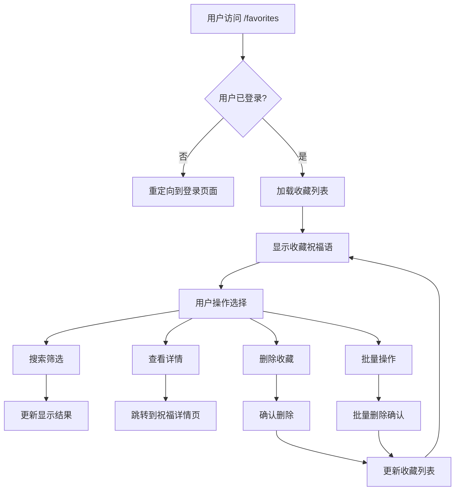

# 收藏页面产品需求文档

## 1. Product Overview
收藏页面是 BlessYou.Today 网站的核心功能页面，为用户提供个人收藏祝福语的集中管理和浏览体验。用户可以在此页面查看、搜索、分类管理所有收藏的祝福语内容，提升用户粘性和使用体验。

该功能旨在解决用户需要快速找到和管理喜爱祝福语的需求，为经常使用祝福语的用户提供便捷的个人内容库。

## 2. Core Features

### 2.1 User Roles
| Role | Registration Method | Core Permissions |
|------|---------------------|------------------|
| Authenticated User | Email registration/login | Can view, add, remove favorites; access personal favorites page |
| Anonymous User | No registration | Cannot access favorites functionality |

### 2.2 Feature Module
收藏页面需求包含以下主要功能模块：
1. **收藏列表展示页面**: 祝福语卡片展示、分页加载、响应式布局
2. **搜索和筛选功能**: 关键词搜索、分类筛选、排序选项
3. **收藏管理操作**: 删除收藏、批量操作、分组管理
4. **状态提示界面**: 加载状态、空状态、错误状态

### 2.3 Page Details
| Page Name | Module Name | Feature description |
|-----------|-------------|---------------------|
| Favorites Page | Header Section | Display page title, total favorites count, search bar with real-time filtering |
| Favorites Page | Filter Controls | Category dropdown, sort options (newest, oldest, alphabetical), view mode toggle (grid/list) |
| Favorites Page | Blessing Cards Grid | Display favorited blessings with title, content preview, category, date added, quick actions (view, remove) |
| Favorites Page | Batch Operations | Select multiple items, bulk delete, export favorites functionality |
| Favorites Page | Pagination | Load more button or infinite scroll for large collections |
| Favorites Page | Empty State | Friendly message and call-to-action when no favorites exist |
| Favorites Page | Loading State | Skeleton loading cards while fetching data |
| Favorites Page | Error Handling | Network error messages, retry functionality |

## 3. Core Process
**用户收藏管理流程**：
1. 用户登录后访问 /favorites 页面
2. 系统加载用户的所有收藏祝福语
3. 用户可以通过搜索框输入关键词进行实时搜索
4. 用户可以通过分类筛选器选择特定类别
5. 用户可以选择不同的排序方式查看收藏
6. 用户点击祝福语卡片查看详细内容
7. 用户可以从收藏中移除不需要的项目
8. 用户可以批量选择和删除多个收藏项目

## 4. User Interface Design
### 4.1 Design Style
- **主色调**: 使用网站主题色 #8B5CF6 (紫色) 作为主要强调色
- **辅助色**: #F3F4F6 (浅灰) 作为背景色，#374151 (深灰) 作为文字色
- **按钮样式**: 圆角按钮设计，hover 状态有颜色过渡效果
- **字体**: 使用系统默认字体栈，标题 16-24px，正文 14-16px
- **布局风格**: 卡片式布局，顶部导航栏，响应式网格系统
- **图标风格**: 使用 Lucide React 图标库，线性风格图标

### 4.2 Page Design Overview
| Page Name | Module Name | UI Elements |
|-----------|-------------|-------------|
| Favorites Page | Header Section | Purple gradient background, white text, search input with rounded corners, favorites count badge |
| Favorites Page | Filter Bar | Horizontal filter controls, dropdown menus with white background, sort buttons with active states |
| Favorites Page | Blessing Cards | White cards with subtle shadow, rounded corners, category tags with colored backgrounds, hover effects |
| Favorites Page | Action Buttons | Primary purple buttons for main actions, secondary gray buttons for cancel/remove actions |
| Favorites Page | Empty State | Centered layout with heart icon, encouraging message, purple CTA button |
| Favorites Page | Loading State | Skeleton cards with animated shimmer effect, matching card dimensions |

### 4.3 Responsiveness
该产品采用移动优先的响应式设计：
- **桌面端**: 3-4 列网格布局，完整的筛选和搜索功能
- **平板端**: 2-3 列网格布局，折叠式筛选菜单
- **移动端**: 单列布局，底部固定操作栏，触摸优化的交互元素
- **触摸交互**: 支持滑动删除、长按选择等移动端手势操作