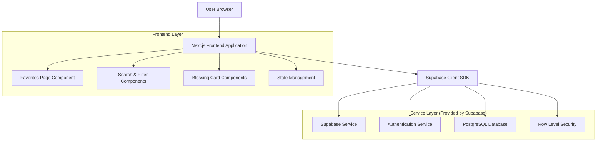
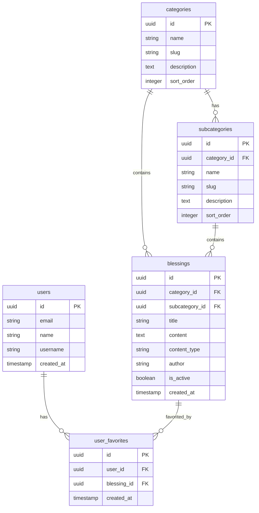

# 收藏页面技术架构文档

## 1. Architecture design



## 2. Technology Description
- Frontend: Next.js@15 + React@18 + TypeScript + Tailwind CSS@3 + Lucide React
- Backend: Supabase (Authentication + PostgreSQL Database)
- State Management: React Hooks (useState, useEffect, useCallback)
- UI Components: Custom components with Tailwind CSS styling

## 3. Route definitions
| Route | Purpose |
|-------|---------|
| /favorites | Main favorites page displaying user's saved blessings with search and filter functionality |
| /favorites?category={slug} | Filtered favorites view showing only blessings from specific category |
| /favorites?search={query} | Search results view showing favorites matching search query |

## 4. API definitions
### 4.1 Core API

获取用户收藏列表
```typescript
// Supabase Query
const { data, error } = await supabase
  .from('user_favorites')
  .select(`
    id,
    created_at,
    blessings (
      id,
      title,
      content,
      content_type,
      author,
      categories (name, slug),
      subcategories (name, slug)
    )
  `)
  .eq('user_id', userId)
  .order('created_at', { ascending: false })
```

删除收藏项目
```typescript
// Supabase Query
const { error } = await supabase
  .from('user_favorites')
  .delete()
  .eq('user_id', userId)
  .eq('blessing_id', blessingId)
```

批量删除收藏
```typescript
// Supabase Query
const { error } = await supabase
  .from('user_favorites')
  .delete()
  .eq('user_id', userId)
  .in('blessing_id', blessingIds)
```

搜索收藏祝福语
```typescript
// Supabase Query with text search
const { data, error } = await supabase
  .from('user_favorites')
  .select(`
    id,
    created_at,
    blessings (
      id,
      title,
      content,
      content_type,
      author,
      categories (name, slug),
      subcategories (name, slug)
    )
  `)
  .eq('user_id', userId)
  .textSearch('blessings.title', searchQuery)
  .order('created_at', { ascending: false })
```

## 5. Data model
### 5.1 Data model definition


### 5.2 Data Definition Language
用户收藏表 (user_favorites) - 已存在
```sql
-- Table already exists from migration 001_create_initial_tables.sql
CREATE TABLE user_favorites (
    id UUID DEFAULT uuid_generate_v4() PRIMARY KEY,
    user_id UUID REFERENCES auth.users(id) ON DELETE CASCADE,
    blessing_id UUID REFERENCES blessings(id) ON DELETE CASCADE,
    created_at TIMESTAMP WITH TIME ZONE DEFAULT NOW(),
    UNIQUE(user_id, blessing_id)
);

-- Indexes already exist
CREATE INDEX idx_user_favorites_user_id ON user_favorites(user_id);
CREATE INDEX idx_user_favorites_blessing_id ON user_favorites(blessing_id);

-- RLS Policies already exist
CREATE POLICY "Users can view their own favorites" ON user_favorites
    FOR SELECT USING (auth.uid() = user_id);

CREATE POLICY "Users can insert their own favorites" ON user_favorites
    FOR INSERT WITH CHECK (auth.uid() = user_id);

CREATE POLICY "Users can delete their own favorites" ON user_favorites
    FOR DELETE USING (auth.uid() = user_id);

-- Permissions already granted
GRANT ALL ON user_favorites TO authenticated;
```

祝福语表 (blessings) - 已存在，支持收藏功能
```sql
-- Table structure supports favorites functionality
-- No additional changes needed for favorites feature
-- Existing indexes and policies are sufficient
```

分类表 (categories, subcategories) - 已存在
```sql
-- Tables already exist and support filtering functionality
-- No additional changes needed
```