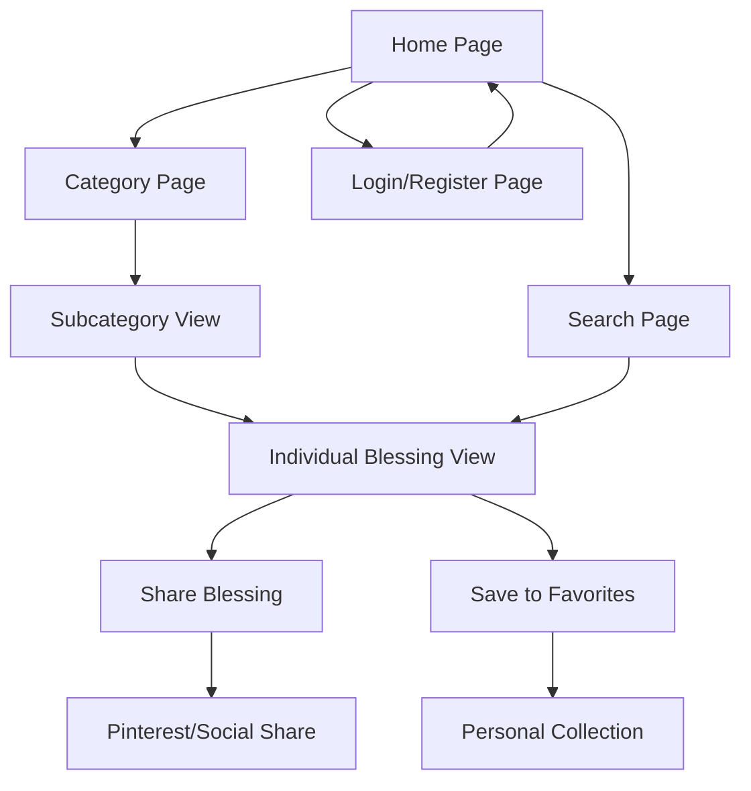

# Blessings Website - Product Requirements Document

## 1. Product Overview

BlessYou.Today is a comprehensive blessings platform that provides users with a curated collection of meaningful blessings, wishes, and inspirational messages for various occasions and life moments.

The platform serves individuals seeking heartfelt blessings to share with loved ones, offering categorized content that makes finding the perfect blessing quick and meaningful. Our goal is to become the go-to destination for authentic, touching blessings that strengthen human connections.

## 2. Core Features

### 2.1 User Roles

| Role | Registration Method | Core Permissions |
|------|---------------------|------------------|
| Visitor | No registration required | Can browse all blessings, use search functionality |
| Registered User | Email registration | Can save favorite blessings, create personal collections |

### 2.2 Feature Module

Our blessings website consists of the following main pages:

1. **Home Page**: Hero section with featured blessings, category navigation, trending blessings showcase, and quick search functionality.
2. **Category Page**: Organized blessing collections by themes with detailed subcategories, filtering options, and pagination.
3. **Search Page**: Advanced search functionality with filters, search results display, and search history for registered users.
4. **Login/Register Page**: User authentication, account creation, and password recovery options.

### 2.3 Detailed Category System

Our platform features a comprehensive 7-category system with targeted subcategories and SEO optimization:

| **Category** | **Subcategories / Content Types** | **SEO Intent** |
|--------------|-----------------------------------|----------------|
| **Daily Blessings** | Morning, Night, Today's Blessing | "daily blessings", "good morning blessings" |
| **Birthday Blessings** | For Friends, Family, Kids, Milestone Ages | "happy birthday blessings quotes" |
| **Wedding & Anniversary Blessings** | Bride, Groom, Parents, Toast Blessings | "wedding blessing quotes", "anniversary blessings" |
| **Religious Blessings** | Christian, Jewish, Islamic, Hindu, Interfaith | "Christian blessings", "Islamic blessings for marriage" |
| **Life Events** | New Baby, Graduation, New Job, Retirement, Recovery | "blessing for new baby", "graduation blessings quotes" |
| **Holiday Blessings** | Christmas, Easter, Thanksgiving, Ramadan, Diwali, Hanukkah | "Christmas blessings for family" |
| **Sympathy & Healing** | Condolences, Illness, Strength | "sympathy blessings quotes", "healing blessings" |

**Content Types for Each Category:**
- **Short blessings** (copy-paste): Quick, memorable phrases perfect for cards, messages, and social media
- **Long-form blessing letters/prayers**: Detailed, heartfelt content for special occasions and deeper spiritual moments
- **Shareable images** (Pinterest-optimized): Visual blessings with beautiful typography and imagery, sized for social media sharing

### 2.4 Page Details

| Page Name | Module Name | Feature Description |
|-----------|-------------|---------------------|
| Home Page | Hero Section | Display featured blessing of the day with beautiful imagery and inspiring quote |
| Home Page | Category Navigation | Show main blessing categories with icons, subcategory previews, and brief descriptions |
| Home Page | Trending Blessings | Display most popular blessings with engagement metrics |
| Home Page | Quick Search | Provide instant search bar with auto-suggestions |
| Home Page | Social Share Widget | Quick share buttons for featured content to major social platforms |
| Category Page | Category Header | Show category title, description, subcategory navigation, and total blessing count with SEO-optimized metadata |
| Category Page | Subcategory Tabs | Horizontal navigation for subcategories with content type filters (short/long/images) |
| Category Page | Blessing Grid | Display blessings in card format with preview text, content type indicators, and sharing options |
| Category Page | Filter Options | Filter by subcategory, content type, occasion, length, language style (formal/casual) |
| Category Page | Pagination | Navigate through multiple pages of blessings with SEO-friendly URLs |
| Category Page | Social Share Integration | Individual share buttons for each blessing card |
| Search Page | Search Interface | Advanced search with keywords, categories, subcategories, content types, and date filters |
| Search Page | Results Display | Show search results with relevance ranking, content type indicators, and snippet previews |
| Search Page | Search History | Save and display recent searches for registered users |
| Search Page | SEO Optimization | Dynamic meta tags based on search queries and results |
| Blessing Detail Page | Content Display | Full blessing text with author attribution, category/subcategory information, and content type badge |
| Blessing Detail Page | Social Share Panel | Comprehensive sharing options with custom messages for each platform |
| Blessing Detail Page | Related Blessings | Suggest similar blessings from same category/subcategory to improve engagement and SEO |
| Blessing Detail Page | Copy Link Feature | One-click link copying with success notification |
| Blessing Detail Page | Pinterest Optimization | Special Pinterest sharing with optimized images and descriptions |
| Login/Register Page | Authentication Form | Email/password login, registration, and social login options |
| Login/Register Page | Password Recovery | Reset password functionality via email verification |

## 3. Core Process

**Visitor Flow:**
Users can immediately access the homepage, browse categories and subcategories, filter by content type, search for specific blessings, and share content without registration. The platform prioritizes accessibility and ease of use for casual visitors.

**Registered User Flow:**
Users register to unlock additional features like saving favorites, creating personal collections organized by categories, and accessing search history. The registration process is streamlined to encourage sign-ups while maintaining the core browsing experience.

## 4. User Interface Design

### 4.1 Design Style

- **Primary Colors**: Warm gold (#F7B801) and deep blue (#1E3A8A) to convey trust and warmth
- **Secondary Colors**: Soft cream (#FEF7ED) and light gray (#F8FAFC) for backgrounds
- **Button Style**: Rounded corners with subtle shadows, gradient backgrounds for primary actions
- **Font**: Inter for headings (clean, modern), Crimson Text for blessing content (elegant, readable)
- **Layout Style**: Card-based design with generous white space, top navigation with breadcrumbs
- **Icons**: Minimalist line icons with occasional filled variants for active states, heart and star emojis for engagement

### 4.2 Page Design Overview

| Page Name | Module Name | UI Elements |
|-----------|-------------|-------------|
| Home Page | Hero Section | Full-width background image with overlay, centered blessing text in elegant typography, subtle animation on scroll |
| Home Page | Category Navigation | Grid layout with 7 category cards, each with custom icon, title, subcategory preview, and blessing count |
| Home Page | Trending Blessings | Horizontal scrollable cards with blessing preview, content type badge, author attribution, and share count |
| Category Page | Category Header | Large banner with category title, description, subcategory navigation tabs, and content type filters |
| Category Page | Blessing Grid | 3-column responsive grid, each card with blessing preview, content type indicator, category tag, and quick actions |
| Category Page | Filter Sidebar | Collapsible left sidebar with checkbox filters for subcategories, content types, search within category, and sort options |
| Search Page | Search Interface | Prominent search bar with advanced filters in expandable section, category/subcategory filters, content type toggles, and recent searches |
| Search Page | Results Display | List view with blessing snippets, content type badges, relevance indicators, and infinite scroll loading |
| Blessing Detail Page | Content Display | Full blessing with content type badge, category breadcrumbs, sharing panel, and Pinterest-optimized image preview |
| Login/Register Page | Authentication Form | Centered modal-style form with tab switching, social login buttons, and validation messages |

### 4.3 Responsiveness

The website follows a mobile-first approach with responsive breakpoints at 768px (tablet) and 1024px (desktop). Touch interactions are optimized for mobile users with larger tap targets and swipe gestures for browsing blessings. The design adapts gracefully across all screen sizes while maintaining the elegant, spiritual aesthetic. Special attention is given to Pinterest-style image layouts for optimal social sharing.

## 5. SEO & Social Media Integration

### 5.1 SEO Optimization Features

- **Dynamic Metadata**: Automatically generate page titles, descriptions, and keywords based on content and category/subcategory
- **Open Graph Tags**: Rich social media previews with custom images and descriptions
- **Twitter Cards**: Optimized Twitter sharing with large image cards
- **Structured Data**: JSON-LD markup for blessings, categories, subcategories, and website information
- **Sitemap Generation**: Automatic XML sitemap creation for search engines including all categories and subcategories
- **Robots.txt**: Proper crawling instructions for search engine bots
- **Canonical URLs**: Prevent duplicate content issues with proper URL canonicalization
- **Category-Specific SEO**: Targeted optimization for each category's primary keywords

### 5.2 Social Sharing Features

**Supported Platforms:**
- Facebook: Share with custom message and blessing preview
- Twitter: Tweet with hashtags and blessing content
- WhatsApp: Direct message sharing with formatted text
- LinkedIn: Professional sharing with blessing context
- Pinterest: Visual sharing with custom blessing images (Pinterest-optimized)
- Copy Link: One-click URL copying with success notification

**Sharing Customization:**
- Platform-specific message formatting
- Custom sharing images for each blessing, especially Pinterest-optimized visuals
- Hashtag suggestions based on blessing categories and subcategories
- Share tracking and analytics
- Social proof display (share counts)
- Pinterest-specific features: Rich Pins, optimized image dimensions (2:3 ratio)

### 5.3 Content Optimization

- **SEO-Friendly URLs**: Clean, descriptive URLs for all pages, categories, subcategories, and blessings
- **Meta Tag Management**: Dynamic generation based on page content, category, and subcategory
- **Image Optimization**: Alt text, proper sizing, lazy loading, and Pinterest-optimized dimensions
- **Page Speed**: Optimized loading times for better search rankings
- **Mobile SEO**: Mobile-first indexing optimization
- **Internal Linking**: Strategic linking between related blessings, categories, and subcategories
- **Content Type Indicators**: Clear labeling of short blessings, long-form content, and shareable images