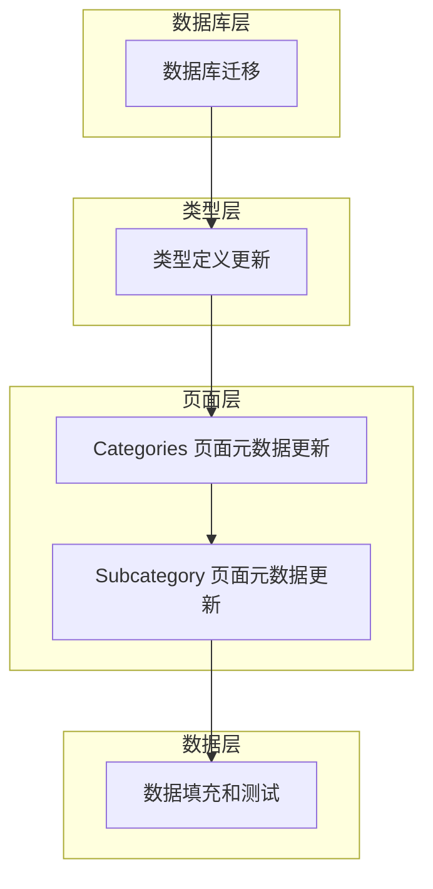
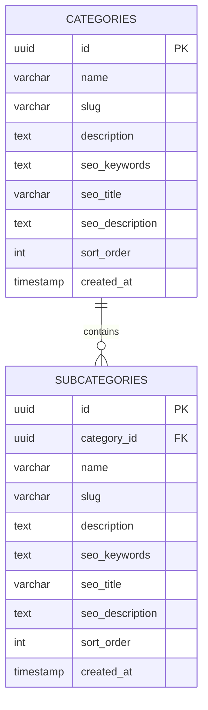

# SEO 字段增强技术文档

## 1. 架构设计



## 2. 技术描述

- 数据库: Supabase (PostgreSQL) 迁移脚本
- 类型定义: TypeScript 接口更新
- 页面元数据: Next.js generateMetadata 函数修改

## 3. 实现步骤

### 3.1 数据库迁移

创建新的迁移文件添加 SEO 字段：

```sql
-- 为 categories 表添加 SEO 字段
ALTER TABLE categories 
ADD COLUMN seo_title VARCHAR(200),
ADD COLUMN seo_description TEXT;

-- 为 subcategories 表添加 SEO 字段  
ALTER TABLE subcategories
ADD COLUMN seo_title VARCHAR(200),
ADD COLUMN seo_description TEXT;

-- 创建索引以提升查询性能
CREATE INDEX idx_categories_seo_title ON categories(seo_title);
CREATE INDEX idx_subcategories_seo_title ON subcategories(seo_title);
```

### 3.2 类型定义更新

更新 TypeScript 接口定义：

```typescript
export interface Category {
  id: string
  name: string
  slug: string
  description: string
  icon: string
  seo_keywords: string
  seo_title?: string        // 新增字段
  seo_description?: string  // 新增字段
  sort_order: number
  created_at: string
  subcategories?: Subcategory[]
}

export interface Subcategory {
  id: string
  category_id: string
  name: string
  slug: string
  description: string
  seo_keywords: string
  seo_title?: string        // 新增字段
  seo_description?: string  // 新增字段
  sort_order: number
  created_at: string
}
```

### 3.3 Categories 页面元数据更新

修改 `/src/app/categories/[slug]/page.tsx` 的 generateMetadata 函数：

```typescript
export async function generateMetadata({ params, searchParams }: CategoryPageProps): Promise<Metadata> {
  const { slug } = await params
  const category = await getCategoryBySlug(slug)
  
  if (!category) {
    return {
      title: 'Category Not Found | BlessYou.Today',
      description: 'The requested category could not be found.',
    }
  }

  const resolvedSearchParams = await searchParams
  const subcategory = resolvedSearchParams.subcategory 
    ? category.subcategories?.find(sub => sub.slug === resolvedSearchParams.subcategory)
    : null

  // 优先使用 seo_title，回退到原有逻辑
  const title = subcategory 
    ? (subcategory.seo_title || `${subcategory.name} ${category.name} | BlessYou.Today`)
    : (category.seo_title || `${category.name} | BlessYou.Today`)
  
  // 优先使用 seo_description，回退到原有逻辑
  const description = subcategory
    ? (subcategory.seo_description || `Find heartfelt ${subcategory.name.toLowerCase()} ${category.name.toLowerCase()} blessings. ${subcategory.description}`)
    : (category.seo_description || `Discover beautiful ${category.name.toLowerCase()} for every occasion. ${category.description}`)

  return {
    title,
    description,
    keywords: `${category.seo_keywords}${subcategory ? `, ${subcategory.seo_keywords}` : ''}`,
    openGraph: {
      title,
      description,
      url: subcategory 
        ? `https://blessyou.today/categories/${category.slug}?subcategory=${subcategory.slug}`
        : `https://blessyou.today/categories/${category.slug}`,
      siteName: 'BlessYou.Today',
      images: [
        {
          url: `/api/og-image/category/${category.slug}${subcategory ? `/${subcategory.slug}` : ''}`,
          width: 1200,
          height: 630,
          alt: title,
        },
      ],
      locale: 'en_US',
      type: 'website',
    },
    twitter: {
      card: 'summary_large_image',
      title,
      description,
      images: [`/api/og-image/category/${category.slug}${subcategory ? `/${subcategory.slug}` : ''}`],
    },
  }
}
```

### 3.4 Subcategory 页面元数据更新

修改 `/src/app/categories/[slug]/[subcategory]/page.tsx` 的 generateMetadata 函数：

```typescript
export async function generateMetadata({ params, searchParams }: SubcategoryPageProps): Promise<Metadata> {
  const { slug, subcategory: subcategorySlug } = await params
  const category = await getCategoryBySlug(slug)
  
  if (!category) {
    return {
      title: 'Category Not Found | BlessYou.Today',
      description: 'The requested category could not be found.',
    }
  }

  const subcategory = await getSubcategoryBySlug(category.id, subcategorySlug)
  
  if (!subcategory) {
    return {
      title: 'Subcategory Not Found | BlessYou.Today',
      description: 'The requested subcategory could not be found.',
    }
  }

  // 优先使用 seo_title，回退到原有逻辑
  const title = subcategory.seo_title || `${subcategory.name} ${category.name} | BlessYou.Today`
  
  // 优先使用 seo_description，回退到原有逻辑
  const description = subcategory.seo_description || `Find heartfelt ${subcategory.name.toLowerCase()} ${category.name.toLowerCase()} blessings. ${subcategory.description || ''}`

  return {
    title,
    description,
    keywords: `${category.seo_keywords}, ${subcategory.seo_keywords || ''}`,
    openGraph: {
      title,
      description,
      url: `https://blessyou.today/categories/${category.slug}/${subcategory.slug}`,
      siteName: 'BlessYou.Today',
      images: [
        {
          url: `/api/og-image/category/${category.slug}/${subcategory.slug}`,
          width: 1200,
          height: 630,
          alt: title,
        },
      ],
      locale: 'en_US',
      type: 'website',
    },
    twitter: {
      card: 'summary_large_image',
      title,
      description,
      images: [`/api/og-image/category/${category.slug}/${subcategory.slug}`],
    },
  }
}
```

## 4. 数据模型

### 4.1 数据模型定义



### 4.2 数据定义语言

```sql
-- 创建迁移文件: 20241218_add_seo_fields.sql

-- 为 categories 表添加 SEO 字段
ALTER TABLE categories 
ADD COLUMN seo_title VARCHAR(200),
ADD COLUMN seo_description TEXT;

-- 为 subcategories 表添加 SEO 字段  
ALTER TABLE subcategories
ADD COLUMN seo_title VARCHAR(200),
ADD COLUMN seo_description TEXT;

-- 创建索引以提升查询性能
CREATE INDEX idx_categories_seo_title ON categories(seo_title);
CREATE INDEX idx_subcategories_seo_title ON subcategories(seo_title);

-- 示例数据更新
UPDATE categories SET 
  seo_title = 'Beautiful Daily Blessings & Inspirational Messages | BlessYou.Today',
  seo_description = 'Start your day with uplifting daily blessings, morning prayers, and evening gratitude messages. Find peace and inspiration for every moment of your day.'
WHERE slug = 'daily-blessings';

UPDATE categories SET 
  seo_title = 'Heartfelt Birthday Blessings & Wishes | BlessYou.Today', 
  seo_description = 'Celebrate special birthdays with meaningful blessings and wishes for friends, family, and loved ones. Find the perfect birthday message for every age and relationship.'
WHERE slug = 'birthday-blessings';

UPDATE subcategories SET
  seo_title = 'Good Morning Blessings & Prayers to Start Your Day | BlessYou.Today',
  seo_description = 'Begin each morning with beautiful blessings and prayers. Find inspiration, gratitude, and positive energy to start your day right.'
WHERE slug = 'morning' AND category_id = (SELECT id FROM categories WHERE slug = 'daily-blessings');

UPDATE subcategories SET
  seo_title = 'Evening Blessings & Peaceful Night Prayers | BlessYou.Today', 
  seo_description = 'End your day with peaceful evening blessings and gratitude prayers. Find comfort and tranquility for a restful night.'
WHERE slug = 'evening' AND category_id = (SELECT id FROM categories WHERE slug = 'daily-blessings');
```

## 5. 实施计划

### 5.1 阶段一：数据库更新
1. 创建迁移文件
2. 执行数据库迁移
3. 验证字段添加成功

### 5.2 阶段二：类型定义更新
1. 更新 TypeScript 接口
2. 确保类型检查通过
3. 更新相关组件类型

### 5.3 阶段三：页面元数据更新
1. 修改 categories 页面元数据逻辑
2. 修改 subcategory 页面元数据逻辑
3. 测试元数据生成

### 5.4 阶段四：数据填充和测试
1. 为现有分类添加 SEO 数据
2. 测试页面元数据显示
3. 验证 SEO 优化效果

## 6. 测试验证

### 6.1 功能测试
- 验证新字段在数据库中正确创建
- 确认页面元数据正确使用新字段
- 测试回退逻辑正常工作

### 6.2 SEO 测试
- 检查页面 title 标签内容
- 验证 meta description 标签
- 确认 Open Graph 元数据正确

### 6.3 兼容性测试
- 确保现有功能不受影响
- 验证页面正常加载和显示
- 测试搜索引擎爬虫友好性

## 7. 部署注意事项

1. **数据库迁移**：在生产环境执行前先在测试环境验证
2. **向后兼容**：新字段为可选字段，确保不影响现有数据
3. **性能影响**：新增索引可能影响写入性能，需要监控
4. **SEO 效果**：部署后需要时间让搜索引擎重新索引页面

## 8. 维护指南

### 8.1 SEO 内容管理
- 定期审查和优化 SEO 标题和描述
- 确保内容与页面实际内容匹配
- 监控搜索引擎排名变化

### 8.2 性能监控
- 监控数据库查询性能
- 跟踪页面加载时间
- 观察 SEO 指标变化

这个实现方案确保了 SEO 字段的平滑集成，同时保持了系统的稳定性和向后兼容性。