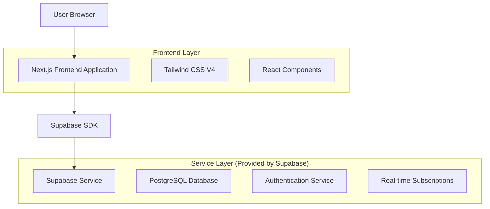
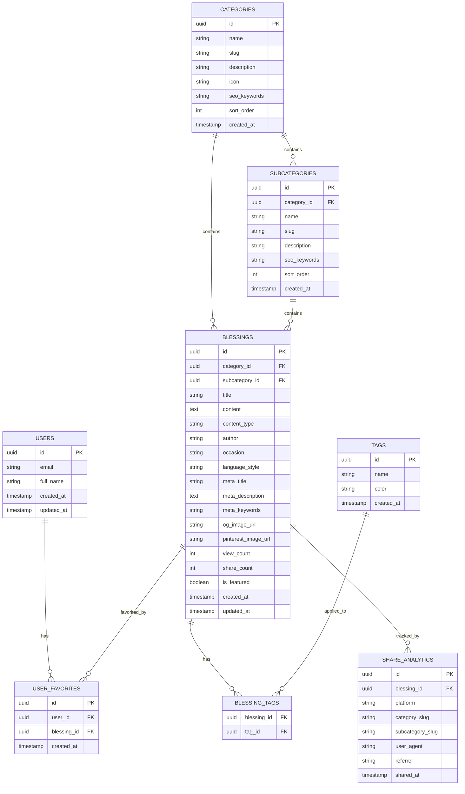

# Blessings Website - Technical Architecture Document

## 1. Architecture Design



## 2. Technology Description

* Frontend: Next.js\@15 + Tailwind CSS V4 + React\@18

* Backend: Supabase (PostgreSQL + Authentication + Real-time)

* Deployment: Vercel (recommended for Next.js)

## 3. Route Definitions

| Route                              | Purpose                                                          |
| ---------------------------------- | ---------------------------------------------------------------- |
| /                                  | Home page, displays featured blessings and category navigation   |
| /categories                        | Category listing page with all available blessing categories     |
| /categories/\[slug]                | Individual category page showing blessings for specific category |
| /categories/\[slug]/\[subcategory] | Subcategory page showing filtered blessings                      |
| /search                            | Search page with advanced filtering and search results           |
| /auth/login                        | User login page                                                  |
| /auth/register                     | User registration page                                           |
| /auth/reset-password               | Password reset page                                              |
| /profile                           | User profile page with saved blessings and collections           |
| /blessing/\[id]                    | Individual blessing detail page with sharing options             |
| /sitemap.xml                       | XML sitemap for search engines                                   |
| /robots.txt                        | Robots.txt file for search engine crawling instructions          |

## 4. API Definitions

### 4.1 Core API

Since we're using Supabase, most API interactions will be handled through the Supabase client SDK. Here are the main data operations:

**Category and Subcategory Operations**

```typescript
// Get all categories with subcategories
const { data: categories } = await supabase
  .from('categories')
  .select(`
    *,
    subcategories (*)
  `)
  .order('sort_order')

// Get blessings by category and subcategory
const { data: blessings } = await supabase
  .from('blessings')
  .select(`
    *,
    categories (name, slug),
    subcategories (name, slug)
  `)
  .eq('category_id', categoryId)
  .eq('subcategory_id', subcategoryId)

// Get blessings by content type
const { data: blessings } = await supabase
  .from('blessings')
  .select('*')
  .eq('content_type', contentType) // 'short', 'long', 'image'
```

**Blessing Operations**

```typescript
// Get all blessings with pagination
const { data: blessings } = await supabase
  .from('blessings')
  .select(`
    *,
    categories (name, slug),
    subcategories (name, slug)
  `)
  .range(0, 9)

// Search blessings with category and content type filters
const { data: blessings } = await supabase
  .from('blessings')
  .select(`
    *,
    categories (name, slug),
    subcategories (name, slug)
  `)
  .textSearch('content', searchQuery)
  .eq('category_id', categoryId)
  .eq('content_type', contentType)

// Update share count
const { error } = await supabase
  .from('blessings')
  .update({ share_count: shareCount + 1 })
  .eq('id', blessingId)
```

**User Authentication**

```typescript
// Register user
const { data, error } = await supabase.auth.signUp({
  email: 'user@example.com',
  password: 'password'
})

// Login user
const { data, error } = await supabase.auth.signInWithPassword({
  email: 'user@example.com',
  password: 'password'
})
```

### 4.2 SEO & Social Sharing API

```typescript
// Dynamic metadata generation for category pages
export async function generateMetadata({ params }: { params: { slug: string, subcategory?: string } }): Promise<Metadata> {
  const category = await getCategoryBySlug(params.slug)
  const subcategory = params.subcategory ? await getSubcategoryBySlug(params.subcategory) : null
  
  const title = subcategory 
    ? `${subcategory.name} ${category.name} | BlessYou.Today`
    : `${category.name} Blessings | BlessYou.Today`
  
  const description = subcategory
    ? `Find heartfelt ${subcategory.name.toLowerCase()} ${category.name.toLowerCase()} blessings. ${subcategory.description}`
    : `Discover beautiful ${category.name.toLowerCase()} blessings for every occasion. ${category.description}`
  
  return {
    title,
    description,
    keywords: `${category.seo_keywords}, ${subcategory?.seo_keywords || ''}`,
    openGraph: {
      title,
      description,
      url: subcategory 
        ? `https://blessyou.today/categories/${category.slug}/${subcategory.slug}`
        : `https://blessyou.today/categories/${category.slug}`,
      siteName: 'BlessYou.Today',
      images: [
        {
          url: `/api/og-image/category/${category.slug}${subcategory ? `/${subcategory.slug}` : ''}`,
          width: 1200,
          height: 630,
          alt: title,
        },
      ],
      locale: 'en_US',
      type: 'website',
    },
    twitter: {
      card: 'summary_large_image',
      title,
      description,
      images: [`/api/og-image/category/${category.slug}${subcategory ? `/${subcategory.slug}` : ''}`],
    },
  }
}

// Dynamic metadata for individual blessings
export async function generateMetadata({ params }: { params: { id: string } }): Promise<Metadata> {
  const blessing = await getBlessingById(params.id)
  
  return {
    title: `${blessing.meta_title || blessing.title} | BlessYou.Today`,
    description: blessing.meta_description || blessing.content.substring(0, 160),
    keywords: blessing.meta_keywords,
    openGraph: {
      title: blessing.title,
      description: blessing.content.substring(0, 160),
      url: `https://blessyou.today/blessing/${blessing.id}`,
      siteName: 'BlessYou.Today',
      images: [
        {
          url: blessing.og_image_url || `/api/og-image/${blessing.id}`,
          width: 1200,
          height: 630,
          alt: blessing.title,
        },
      ],
      locale: 'en_US',
      type: 'article',
    },
    twitter: {
      card: 'summary_large_image',
      title: blessing.title,
      description: blessing.content.substring(0, 160),
      images: [blessing.og_image_url || `/api/og-image/${blessing.id}`],
    },
  }
}
```

**Social Sharing Functions with Pinterest Optimization**

```typescript
// Share tracking with category and subcategory context
const trackShare = async (blessingId: string, platform: string, categorySlug?: string, subcategorySlug?: string) => {
  await supabase.from('share_analytics').insert({
    blessing_id: blessingId,
    platform,
    category_slug: categorySlug,
    subcategory_slug: subcategorySlug,
    shared_at: new Date().toISOString()
  })
  
  // Update blessing share count
  await supabase.rpc('increment_share_count', { blessing_id: blessingId })
}

// Generate sharing URLs with category context
const generateShareUrls = (blessing: Blessing) => {
  const url = `https://blessyou.today/blessing/${blessing.id}`
  const text = `${blessing.title} - ${blessing.content.substring(0, 100)}...`
  const hashtags = [
    'blessings',
    'inspiration',
    blessing.categories?.slug,
    blessing.subcategories?.slug
  ].filter(Boolean).join(',')
  
  return {
    facebook: `https://www.facebook.com/sharer/sharer.php?u=${encodeURIComponent(url)}`,
    twitter: `https://twitter.com/intent/tweet?text=${encodeURIComponent(text)}&url=${encodeURIComponent(url)}&hashtags=${hashtags}`,
    whatsapp: `https://wa.me/?text=${encodeURIComponent(`${text} ${url}`)}`,
    linkedin: `https://www.linkedin.com/sharing/share-offsite/?url=${encodeURIComponent(url)}`,
    pinterest: `https://pinterest.com/pin/create/button/?url=${encodeURIComponent(url)}&description=${encodeURIComponent(text)}&media=${encodeURIComponent(blessing.pinterest_image_url || blessing.og_image_url)}`
  }
}

// Pinterest-specific sharing optimization
const generatePinterestData = (blessing: Blessing) => {
  return {
    url: `https://blessyou.today/blessing/${blessing.id}`,
    media: blessing.pinterest_image_url || blessing.og_image_url,
    description: `${blessing.title} - Perfect for ${blessing.subcategories?.name || blessing.categories?.name}. ${blessing.content.substring(0, 200)}... #blessings #${blessing.categories?.slug} #${blessing.subcategories?.slug}`,
    method: 'button',
    custom: true
  }
}
```

## 5. Data Model

### 5.1 Data Model Definition



### 5.2 Data Definition Language

**Categories Table**

```sql
-- Create categories table
CREATE TABLE categories (
    id UUID PRIMARY KEY DEFAULT gen_random_uuid(),
    name VARCHAR(100) NOT NULL,
    slug VARCHAR(100) UNIQUE NOT NULL,
    description TEXT,
    icon VARCHAR(50),
    seo_keywords VARCHAR(500),
    sort_order INTEGER DEFAULT 0,
    created_at TIMESTAMP WITH TIME ZONE DEFAULT NOW()
);

-- Create index
CREATE INDEX idx_categories_slug ON categories(slug);
CREATE INDEX idx_categories_sort_order ON categories(sort_order);

-- Grant permissions
GRANT SELECT ON categories TO anon;
GRANT ALL PRIVILEGES ON categories TO authenticated;

-- Insert initial data with new category system
INSERT INTO categories (name, slug, description, icon, seo_keywords, sort_order) VALUES
('Daily Blessings', 'daily-blessings', 'Start and end your day with meaningful blessings', '🌅', 'daily blessings, good morning blessings, evening prayers', 1),
('Birthday Blessings', 'birthday-blessings', 'Heartfelt birthday wishes for every age and relationship', '🎂', 'happy birthday blessings quotes, birthday wishes', 2),
('Wedding & Anniversary Blessings', 'wedding-anniversary', 'Beautiful blessings for love and marriage celebrations', '💒', 'wedding blessing quotes, anniversary blessings, marriage prayers', 3),
('Religious Blessings', 'religious-blessings', 'Spiritual blessings from various faith traditions', '🙏', 'Christian blessings, Islamic blessings for marriage, religious prayers', 4),
('Life Events', 'life-events', 'Blessings for major life milestones and transitions', '🌟', 'blessing for new baby, graduation blessings quotes, new job blessings', 5),
('Holiday Blessings', 'holiday-blessings', 'Seasonal and holiday blessings for celebrations', '🎄', 'Christmas blessings for family, Easter blessings, holiday prayers', 6),
('Sympathy & Healing', 'sympathy-healing', 'Comforting blessings for difficult times', '💚', 'sympathy blessings quotes, healing blessings, comfort prayers', 7);
```

**Subcategories Table**

```sql
-- Create subcategories table
CREATE TABLE subcategories (
    id UUID PRIMARY KEY DEFAULT gen_random_uuid(),
    category_id UUID REFERENCES categories(id) ON DELETE CASCADE,
    name VARCHAR(100) NOT NULL,
    slug VARCHAR(100) NOT NULL,
    description TEXT,
    seo_keywords VARCHAR(500),
    sort_order INTEGER DEFAULT 0,
    created_at TIMESTAMP WITH TIME ZONE DEFAULT NOW(),
    UNIQUE(category_id, slug)
);

-- Create indexes
CREATE INDEX idx_subcategories_category_id ON subcategories(category_id);
CREATE INDEX idx_subcategories_slug ON subcategories(slug);
CREATE INDEX idx_subcategories_sort_order ON subcategories(sort_order);

-- Grant permissions
GRANT SELECT ON subcategories TO anon;
GRANT ALL PRIVILEGES ON subcategories TO authenticated;

-- Insert subcategories for Daily Blessings
INSERT INTO subcategories (category_id, name, slug, description, seo_keywords, sort_order) 
SELECT id, 'Morning', 'morning', 'Start your day with uplifting morning blessings', 'good morning blessings, morning prayers', 1
FROM categories WHERE slug = 'daily-blessings';

INSERT INTO subcategories (category_id, name, slug, description, seo_keywords, sort_order) 
SELECT id, 'Night', 'night', 'End your day with peaceful evening blessings', 'good night blessings, evening prayers', 2
FROM categories WHERE slug = 'daily-blessings';

INSERT INTO subcategories (category_id, name, slug, description, seo_keywords, sort_order) 
SELECT id, 'Today''s Blessing', 'todays-blessing', 'Special blessing for today', 'daily inspiration, today blessing', 3
FROM categories WHERE slug = 'daily-blessings';

-- Insert subcategories for Birthday Blessings
INSERT INTO subcategories (category_id, name, slug, description, seo_keywords, sort_order) 
SELECT id, 'For Friends', 'for-friends', 'Birthday blessings for your dear friends', 'birthday wishes for friends, friend birthday blessings', 1
FROM categories WHERE slug = 'birthday-blessings';

INSERT INTO subcategories (category_id, name, slug, description, seo_keywords, sort_order) 
SELECT id, 'Family', 'family', 'Special birthday blessings for family members', 'family birthday wishes, birthday blessings family', 2
FROM categories WHERE slug = 'birthday-blessings';

INSERT INTO subcategories (category_id, name, slug, description, seo_keywords, sort_order) 
SELECT id, 'Kids', 'kids', 'Fun and loving birthday blessings for children', 'kids birthday wishes, children birthday blessings', 3
FROM categories WHERE slug = 'birthday-blessings';

INSERT INTO subcategories (category_id, name, slug, description, seo_keywords, sort_order) 
SELECT id, 'Milestone Ages', 'milestone-ages', 'Special blessings for milestone birthdays', 'milestone birthday wishes, 18th 21st 50th birthday', 4
FROM categories WHERE slug = 'birthday-blessings';

-- Continue with other categories...
-- (Additional subcategory inserts for all 7 categories would follow the same pattern)
```

**Enhanced Blessings Table**

```sql
-- Create blessings table with category/subcategory support
CREATE TABLE blessings (
    id UUID PRIMARY KEY DEFAULT gen_random_uuid(),
    category_id UUID REFERENCES categories(id),
    subcategory_id UUID REFERENCES subcategories(id),
    title VARCHAR(200) NOT NULL,
    content TEXT NOT NULL,
    content_type VARCHAR(20) DEFAULT 'short' CHECK (content_type IN ('short', 'long', 'image')),
    author VARCHAR(100),
    occasion VARCHAR(100),
    language_style VARCHAR(20) DEFAULT 'formal' CHECK (language_style IN ('formal', 'casual')),
    meta_title VARCHAR(200),
    meta_description TEXT,
    meta_keywords VARCHAR(500),
    og_image_url VARCHAR(500),
    pinterest_image_url VARCHAR(500),
    view_count INTEGER DEFAULT 0,
    share_count INTEGER DEFAULT 0,
    is_featured BOOLEAN DEFAULT FALSE,
    created_at TIMESTAMP WITH TIME ZONE DEFAULT NOW(),
    updated_at TIMESTAMP WITH TIME ZONE DEFAULT NOW()
);

-- Create indexes
CREATE INDEX idx_blessings_category_id ON blessings(category_id);
CREATE INDEX idx_blessings_subcategory_id ON blessings(subcategory_id);
CREATE INDEX idx_blessings_content_type ON blessings(content_type);
CREATE INDEX idx_blessings_is_featured ON blessings(is_featured);
CREATE INDEX idx_blessings_created_at ON blessings(created_at DESC);
CREATE INDEX idx_blessings_view_count ON blessings(view_count DESC);

-- Create full-text search index
CREATE INDEX idx_blessings_content_search ON blessings USING gin(to_tsvector('english', content));

-- Grant permissions
GRANT SELECT ON blessings TO anon;
GRANT ALL PRIVILEGES ON blessings TO authenticated;
```

**Enhanced Share Analytics Table**

```sql
-- Create share_analytics table with category tracking
CREATE TABLE share_analytics (
    id UUID PRIMARY KEY DEFAULT gen_random_uuid(),
    blessing_id UUID REFERENCES blessings(id) ON DELETE CASCADE,
    platform VARCHAR(50) NOT NULL,
    category_slug VARCHAR(100),
    subcategory_slug VARCHAR(100),
    user_agent TEXT,
    referrer VARCHAR(500),
    shared_at TIMESTAMP WITH TIME ZONE DEFAULT NOW()
);

-- Create indexes
CREATE INDEX idx_share_analytics_blessing_id ON share_analytics(blessing_id);
CREATE INDEX idx_share_analytics_platform ON share_analytics(platform);
CREATE INDEX idx_share_analytics_category_slug ON share_analytics(category_slug);
CREATE INDEX idx_share_analytics_subcategory_slug ON share_analytics(subcategory_slug);
CREATE INDEX idx_share_analytics_shared_at ON share_analytics(shared_at DESC);

-- Grant permissions
GRANT SELECT ON share_analytics TO anon;
GRANT ALL PRIVILEGES ON share_analytics TO authenticated;
```

**Enhanced Database Functions**

```sql
-- Function to get trending blessings by category
CREATE OR REPLACE FUNCTION get_trending_blessings_by_category(
    category_slug VARCHAR DEFAULT NULL,
    subcategory_slug VARCHAR DEFAULT NULL,
    limit_count INTEGER DEFAULT 10
)
RETURNS TABLE(
    id UUID,
    title VARCHAR,
    content TEXT,
    content_type VARCHAR,
    category_name VARCHAR,
    subcategory_name VARCHAR,
    view_count INTEGER,
    share_count INTEGER,
    trending_score NUMERIC
) AS $$
BEGIN
    RETURN QUERY
    SELECT 
        b.id,
        b.title,
        b.content,
        b.content_type,
        c.name as category_name,
        sc.name as subcategory_name,
        b.view_count,
        b.share_count,
        (b.view_count * 0.3 + b.share_count * 0.7) as trending_score
    FROM blessings b
    JOIN categories c ON b.category_id = c.id
    LEFT JOIN subcategories sc ON b.subcategory_id = sc.id
    WHERE (category_slug IS NULL OR c.slug = category_slug)
    AND (subcategory_slug IS NULL OR sc.slug = subcategory_slug)
    ORDER BY trending_score DESC
    LIMIT limit_count;
END;
$$ LANGUAGE plpgsql;

-- Function to get SEO-optimized sitemap data
CREATE OR REPLACE FUNCTION get_sitemap_data()
RETURNS TABLE(
    url VARCHAR,
    lastmod TIMESTAMP,
    changefreq VARCHAR,
    priority NUMERIC
) AS $$
BEGIN
    -- Return category pages
    RETURN QUERY
    SELECT 
        CONCAT('/categories/', c.slug) as url,
        c.created_at as lastmod,
        'weekly'::VARCHAR as changefreq,
        0.8::NUMERIC as priority
    FROM categories c;
    
    -- Return subcategory pages
    RETURN QUERY
    SELECT 
        CONCAT('/categories/', c.slug, '/', sc.slug) as url,
        sc.created_at as lastmod,
        'weekly'::VARCHAR as changefreq,
        0.7::NUMERIC as priority
    FROM subcategories sc
    JOIN categories c ON sc.category_id = c.id;
    
    -- Return blessing pages
    RETURN QUERY
    SELECT 
        CONCAT('/blessing/', b.id::VARCHAR) as url,
        b.updated_at as lastmod,
        'monthly'::VARCHAR as changefreq,
        CASE WHEN b.is_featured THEN 0.9 ELSE 0.6 END as priority
    FROM blessings b;
END;
$$ LANGUAGE plpgsql;
```

