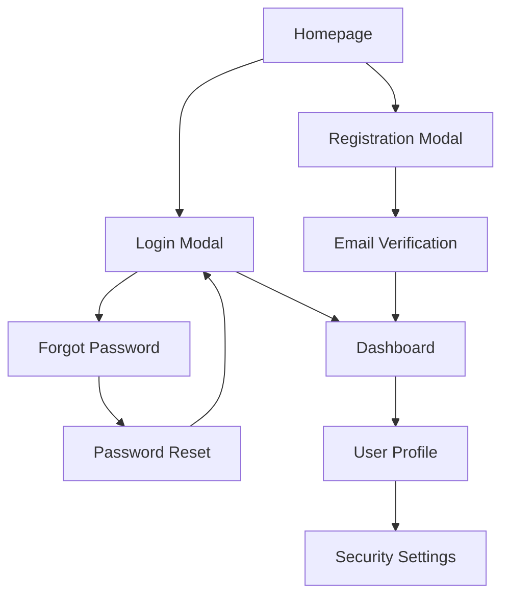

# User Authentication System - Product Requirements Document

## 1. Product Overview

This document outlines the comprehensive user authentication system for BlessYou.Today, a blessing sharing platform. The system provides secure user registration, login, and account management functionality with robust security measures and excellent user experience.

The authentication system enables users to create accounts, securely access their personalized content, manage their favorite blessings, and maintain their preferences across sessions while ensuring data protection and preventing unauthorized access.

## 2. Core Features

### 2.1 User Roles

| Role | Registration Method | Core Permissions |
|------|---------------------|------------------|
| Guest User | No registration required | Can browse public blessings, use search functionality |
| Registered User | Email registration with verification | Can save favorites, create collections, access personalized content, post comments |
| Premium User | Upgrade from registered user | Access to exclusive content, advanced features, priority support |

### 2.2 Feature Module

Our authentication system consists of the following main components:

1. **Registration Page**: Email verification, password strength validation, terms acceptance
2. **Login Page**: Credential validation, remember me option, forgot password link
3. **Password Recovery**: Email-based password reset, secure token validation
4. **User Profile**: Account information display, settings management, security options
5. **Security Dashboard**: Login history, active sessions, security settings

### 2.3 Page Details

| Page Name | Module Name | Feature description |
|-----------|-------------|---------------------|
| Registration Page | Email Validation | Validate email format and check for existing accounts. Send verification email with secure token |
| Registration Page | Password Strength | Real-time password strength indicator with requirements (8+ chars, uppercase, lowercase, number, special char) |
| Registration Page | Form Validation | Validate all required fields, confirm password match, terms acceptance |
| Login Page | Credential Verification | Authenticate user credentials against encrypted database records |
| Login Page | Remember Me | Persistent login session using secure cookies with configurable expiration |
| Login Page | Account Lockout | Temporary account lockout after 5 failed login attempts within 15 minutes |
| Password Recovery | Reset Request | Generate secure reset token, send email with time-limited reset link |
| Password Recovery | Token Validation | Validate reset token authenticity and expiration before allowing password change |
| User Profile | Information Display | Show user details, registration date, account status, login statistics |
| User Profile | Security Settings | Change password, enable 2FA, manage active sessions, view login history |
| Security Dashboard | Session Management | Display active sessions with device info, location, last activity |
| Security Dashboard | Login History | Show recent login attempts with timestamps, IP addresses, success/failure status |

## 3. Core Process

### Guest User Flow
1. User visits the website and can browse public content
2. User clicks "Sign Up" to create an account or "Sign In" to access existing account
3. After successful authentication, user gains access to personalized features

### Registration Flow
1. User clicks "Sign Up" button from header or login modal
2. User fills registration form (email, password, confirm password)
3. System validates form data and password strength in real-time
4. User accepts terms and conditions
5. System sends verification email to provided address
6. User clicks verification link in email
7. Account is activated and user is automatically logged in

### Login Flow
1. User clicks "Sign In" button
2. User enters email/username and password
3. System validates credentials and checks for account lockout
4. If "Remember Me" is checked, system creates persistent session
5. User is redirected to dashboard or previous page
6. Failed attempts are logged and contribute to lockout counter

### Password Recovery Flow
1. User clicks "Forgot Password" on login page
2. User enters email address
3. System generates secure reset token and sends email
4. User clicks reset link in email (valid for 1 hour)
5. User enters new password with strength validation
6. System updates password and invalidates reset token
7. User receives confirmation email

## 4. User Interface Design

### 4.1 Design Style

- **Primary Colors**: Orange gradient (#fbbf24 to #f97316), White (#ffffff)
- **Secondary Colors**: Gray scale (#f3f4f6, #6b7280, #374151)
- **Button Style**: Rounded corners (12px), gradient backgrounds, subtle shadows with hover effects
- **Font**: System fonts with fallbacks, 14px base size, semibold for labels
- **Layout Style**: Modal-based authentication, card layouts, clean spacing
- **Icons**: Lucide React icons, 16px-20px sizes, consistent stroke width

### 4.2 Page Design Overview

| Page Name | Module Name | UI Elements |
|-----------|-------------|-------------|
| Registration Modal | Header Section | Orange gradient background, white text with shadow, brand logo, close button |
| Registration Modal | Form Fields | Rounded input fields with icons, floating labels, error states with red borders |
| Registration Modal | Password Strength | Progress bar with color coding (red/amber/green), feedback text |
| Registration Modal | Submit Button | Full-width orange gradient button, loading spinner, disabled state |
| Login Modal | Mode Toggle | Tab-style buttons with orange underline indicator for active state |
| Login Modal | Remember Me | Custom checkbox with orange accent, hover effects |
| Login Modal | Forgot Password | Text link with blue color, subtle underline on hover |
| Password Recovery | Email Input | Single input field with mail icon, validation feedback |
| Password Recovery | Success Message | Green background alert with check icon, auto-dismiss |
| User Profile | Avatar Section | Circular profile image placeholder, upload button |
| User Profile | Information Cards | White cards with subtle borders, organized sections |
| Security Dashboard | Session List | Table layout with device icons, location info, action buttons |
| Security Dashboard | Login History | Timeline view with status indicators, IP addresses |

### 4.3 Responsiveness

The authentication system is mobile-first responsive design with:
- Modal dialogs that adapt to screen size (full-screen on mobile)
- Touch-optimized input fields and buttons (minimum 44px touch targets)
- Optimized keyboard navigation and form submission
- Responsive typography scaling from 14px (mobile) to 16px (desktop)
- Adaptive spacing and layout for different screen sizes