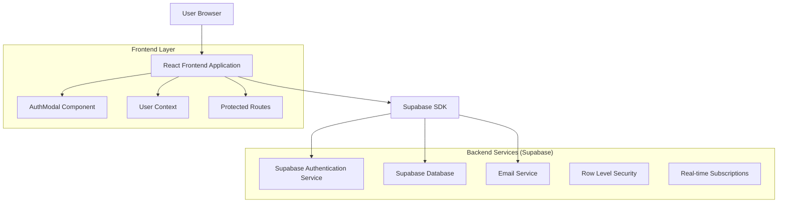
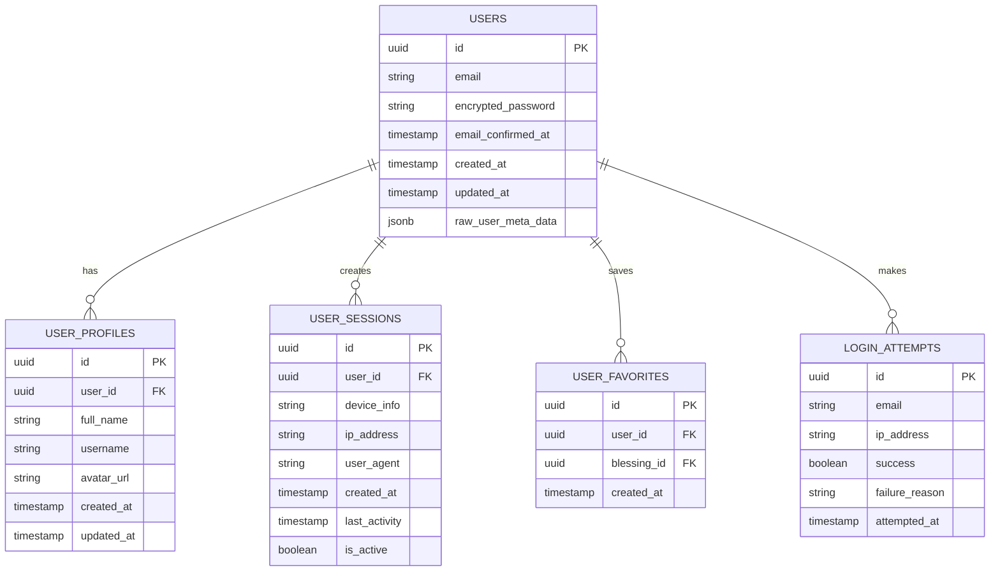

# User Authentication System - Technical Architecture Document

## 1. Architecture Design



## 2. Technology Description

- **Frontend**: React@18 + TypeScript + Tailwind CSS@3 + Next.js@14
- **Backend**: Supabase (Authentication, Database, Real-time)
- **Email Service**: Supabase Auth (built-in email templates)
- **State Management**: React Context + useState/useEffect hooks
- **Form Validation**: Custom validation with real-time feedback
- **Security**: Supabase RLS (Row Level Security) + JWT tokens

## 3. Route Definitions

| Route | Purpose |
|-------|---------|
| / | Homepage with authentication modal access |
| /profile | User profile page (protected route) |
| /settings | User account settings (protected route) |
| /auth/callback | Supabase authentication callback handler |
| /auth/reset-password | Password reset confirmation page |
| /auth/verify-email | Email verification confirmation page |

## 4. API Definitions

### 4.1 Authentication APIs (Supabase Auth)

**User Registration**
```typescript
supabase.auth.signUp({
  email: string,
  password: string,
  options: {
    data: {
      full_name?: string,
      username?: string
    }
  }
})
```

**User Login**
```typescript
supabase.auth.signInWithPassword({
  email: string,
  password: string
})
```

**Password Reset Request**
```typescript
supabase.auth.resetPasswordForEmail(email: string, {
  redirectTo: string
})
```

**Password Update**
```typescript
supabase.auth.updateUser({
  password: string
})
```

**Session Management**
```typescript
supabase.auth.getSession()
supabase.auth.onAuthStateChange(callback)
supabase.auth.signOut()
```

### 4.2 User Data APIs

**Get User Profile**
```
GET /rest/v1/profiles?id=eq.{user_id}
```

Response:
| Param Name | Param Type | Description |
|------------|------------|-------------|
| id | uuid | User unique identifier |
| email | string | User email address |
| full_name | string | User display name |
| avatar_url | string | Profile image URL |
| created_at | timestamp | Account creation date |
| updated_at | timestamp | Last profile update |

**Update User Profile**
```
PATCH /rest/v1/profiles?id=eq.{user_id}
```

Request:
| Param Name | Param Type | isRequired | Description |
|------------|------------|------------|-------------|
| full_name | string | false | Updated display name |
| avatar_url | string | false | New profile image URL |

### 4.3 Security APIs

**Get Login History**
```
GET /rest/v1/user_sessions?user_id=eq.{user_id}
```

**Revoke Session**
```
DELETE /rest/v1/user_sessions?id=eq.{session_id}
```

## 5. Data Model

### 5.1 Data Model Definition



### 5.2 Data Definition Language

**User Profiles Table**
```sql
-- Create user profiles table
CREATE TABLE user_profiles (
    id UUID PRIMARY KEY DEFAULT gen_random_uuid(),
    user_id UUID REFERENCES auth.users(id) ON DELETE CASCADE,
    full_name VARCHAR(100),
    username VARCHAR(50) UNIQUE,
    avatar_url TEXT,
    created_at TIMESTAMP WITH TIME ZONE DEFAULT NOW(),
    updated_at TIMESTAMP WITH TIME ZONE DEFAULT NOW()
);

-- Create indexes
CREATE INDEX idx_user_profiles_user_id ON user_profiles(user_id);
CREATE INDEX idx_user_profiles_username ON user_profiles(username);

-- Enable RLS
ALTER TABLE user_profiles ENABLE ROW LEVEL SECURITY;

-- RLS Policies
CREATE POLICY "Users can view own profile" ON user_profiles
    FOR SELECT USING (auth.uid() = user_id);

CREATE POLICY "Users can update own profile" ON user_profiles
    FOR UPDATE USING (auth.uid() = user_id);

CREATE POLICY "Users can insert own profile" ON user_profiles
    FOR INSERT WITH CHECK (auth.uid() = user_id);
```

**User Sessions Table**
```sql
-- Create user sessions table
CREATE TABLE user_sessions (
    id UUID PRIMARY KEY DEFAULT gen_random_uuid(),
    user_id UUID REFERENCES auth.users(id) ON DELETE CASCADE,
    device_info TEXT,
    ip_address INET,
    user_agent TEXT,
    created_at TIMESTAMP WITH TIME ZONE DEFAULT NOW(),
    last_activity TIMESTAMP WITH TIME ZONE DEFAULT NOW(),
    is_active BOOLEAN DEFAULT true
);

-- Create indexes
CREATE INDEX idx_user_sessions_user_id ON user_sessions(user_id);
CREATE INDEX idx_user_sessions_last_activity ON user_sessions(last_activity DESC);

-- Enable RLS
ALTER TABLE user_sessions ENABLE ROW LEVEL SECURITY;

-- RLS Policies
CREATE POLICY "Users can view own sessions" ON user_sessions
    FOR SELECT USING (auth.uid() = user_id);

CREATE POLICY "Users can delete own sessions" ON user_sessions
    FOR DELETE USING (auth.uid() = user_id);
```

**Login Attempts Table**
```sql
-- Create login attempts table for security monitoring
CREATE TABLE login_attempts (
    id UUID PRIMARY KEY DEFAULT gen_random_uuid(),
    email VARCHAR(255),
    ip_address INET,
    success BOOLEAN DEFAULT false,
    failure_reason VARCHAR(100),
    attempted_at TIMESTAMP WITH TIME ZONE DEFAULT NOW()
);

-- Create indexes
CREATE INDEX idx_login_attempts_email ON login_attempts(email);
CREATE INDEX idx_login_attempts_ip_address ON login_attempts(ip_address);
CREATE INDEX idx_login_attempts_attempted_at ON login_attempts(attempted_at DESC);

-- Enable RLS (admin access only)
ALTER TABLE login_attempts ENABLE ROW LEVEL SECURITY;
```

**User Favorites Table**
```sql
-- Create user favorites table
CREATE TABLE user_favorites (
    id UUID PRIMARY KEY DEFAULT gen_random_uuid(),
    user_id UUID REFERENCES auth.users(id) ON DELETE CASCADE,
    blessing_id UUID REFERENCES blessings(id) ON DELETE CASCADE,
    created_at TIMESTAMP WITH TIME ZONE DEFAULT NOW(),
    UNIQUE(user_id, blessing_id)
);

-- Create indexes
CREATE INDEX idx_user_favorites_user_id ON user_favorites(user_id);
CREATE INDEX idx_user_favorites_blessing_id ON user_favorites(blessing_id);

-- Enable RLS
ALTER TABLE user_favorites ENABLE ROW LEVEL SECURITY;

-- RLS Policies
CREATE POLICY "Users can manage own favorites" ON user_favorites
    FOR ALL USING (auth.uid() = user_id);
```

**Database Functions for Security**
```sql
-- Function to check login attempt rate limiting
CREATE OR REPLACE FUNCTION check_login_rate_limit(user_email TEXT, client_ip INET)
RETURNS BOOLEAN AS $$
DECLARE
    attempt_count INTEGER;
BEGIN
    -- Count failed attempts in last 15 minutes
    SELECT COUNT(*) INTO attempt_count
    FROM login_attempts
    WHERE email = user_email
    AND ip_address = client_ip
    AND success = false
    AND attempted_at > NOW() - INTERVAL '15 minutes';
    
    -- Return false if more than 5 attempts
    RETURN attempt_count < 5;
END;
$$ LANGUAGE plpgsql SECURITY DEFINER;

-- Function to log login attempts
CREATE OR REPLACE FUNCTION log_login_attempt(
    user_email TEXT,
    client_ip INET,
    is_success BOOLEAN,
    reason TEXT DEFAULT NULL
)
RETURNS VOID AS $$
BEGIN
    INSERT INTO login_attempts (email, ip_address, success, failure_reason)
    VALUES (user_email, client_ip, is_success, reason);
END;
$$ LANGUAGE plpgsql SECURITY DEFINER;
```

## 6. Security Implementation

### 6.1 Authentication Security
- **Password Hashing**: Supabase uses bcrypt with salt for password encryption
- **JWT Tokens**: Secure token-based authentication with configurable expiration
- **Rate Limiting**: Maximum 5 failed login attempts per IP/email in 15 minutes
- **Session Management**: Secure session tokens with automatic refresh

### 6.2 Data Protection
- **Row Level Security**: Database-level access control based on user authentication
- **CSRF Protection**: Built-in CSRF protection through Supabase Auth
- **SQL Injection Prevention**: Parameterized queries and ORM protection
- **XSS Prevention**: Input sanitization and Content Security Policy headers

### 6.3 Email Security
- **Email Verification**: Required email confirmation for account activation
- **Password Reset**: Time-limited secure tokens (1 hour expiration)
- **Email Templates**: Secure, branded email templates with anti-phishing measures
- **Rate Limiting**: Email sending rate limits to prevent abuse